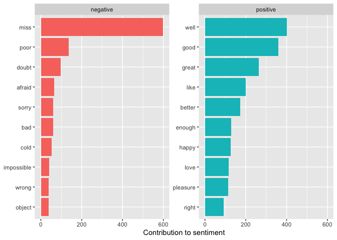
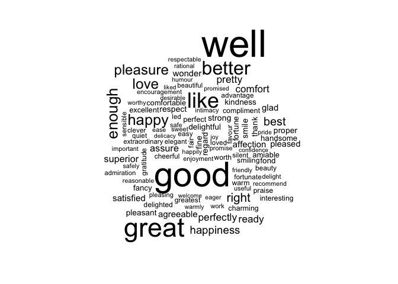
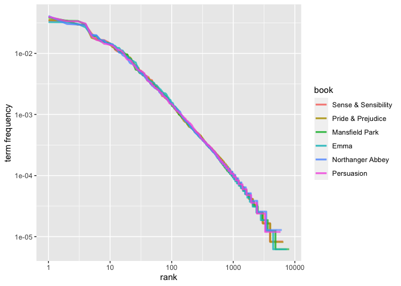

Week 1 - NLP Reading Course Notes
================
2022-01-14

This Rmarkdown includes the notes for my course readings in INF2010 -
Reading Course: Natural Language Processing. This week’s readings
include:

-   Silge, Julia & David Robinson, 2020, Text Mining with R, Chapters
    1-4: <https://www.tidytextmining.com>.
-   Hovy, Dirk and Shannon L. Spruit, 2016, ‘The Social Impact of
    Natural Language Processing’, Proceedings of the 54th Annual Meeting
    of the Association for Computational Linguistics,
    pp. 591–598,<https://aclweb.org/anthology/P16-2096.pdf>.
-   Prabhumoye, Shrimai, Elijah Mayfield, and Alan W Black, 2019,
    ‘Principled Frameworks for Evaluating Ethics in NLP Systems’,
    Proceedings of the 2019 Workshop on Widening NLP,
    <https://aclweb.org/anthology/W19-3637/>.

## Text Mining in R

### Dependencies

``` r
library(tidyverse)
library(tidytext)
library(janeaustenr)
library(wordcloud)
```

### Chapter 1 - The tidy text format

**Tidy data** has the structure:

-   Each variable is a column
-   Each observation is a row
-   Each type of observational unit is a table

**Tidy Text format** is a table with one-token-per-row.

A **token** is a meaningful unit of text, most often a word, that we are
interested in using for further analysis, and **tokenization** is the
process of splitting text into tokens.

A **corpus** typically contains raw string annotated with additional
metadata and details.

A **Document-term matrix** is a sparse matrix with one row per document
and one columns for each term. The value is typically a word count or
tf-idf.

A **tibble** is a modern class of data frame in R. It provides the
following advantages over a dataframe:

-   has a convenient print method
-   will not convert strings to factors
-   does not use row names

The `unnest_tokens()` function allows us to easily split rows of strings
to a tidy format.

``` r
# Create some sample data with text
my_data <- tibble(
  line = 1:3, 
  text = c("Hello world", "HOW are yOu dOiNg?", "what's go!i@ng o-n?")
)

# Break into tokens
my_data %>% 
  unnest_tokens(word, text)
```

    ## # A tibble: 12 × 2
    ##     line word  
    ##    <int> <chr> 
    ##  1     1 hello 
    ##  2     1 world 
    ##  3     2 how   
    ##  4     2 are   
    ##  5     2 you   
    ##  6     2 doing 
    ##  7     3 what's
    ##  8     3 go    
    ##  9     3 i     
    ## 10     3 ng    
    ## 11     3 o     
    ## 12     3 n

Something interesting I found is that `unnest_tokens`, splits on
punctuation other than apostrophe. Above you can see that “<go!i@ing>”
was split into three tokens: “go”, “i”, and “ng”. And “what’s” was left
in tact.

#### Tidying the works of Jane Austen

``` r
# Add line numbers and chapter numbers
original_books <- austen_books() %>% 
  group_by(book) %>% 
  mutate(line_number = row_number(),
         chapter = cumsum(str_detect(text, regex("^chapter [\\divxlc]",
                                           ignore_case = TRUE)))) %>% 
  ungroup()

# Extract tokens
tidy_books <- original_books %>% 
  unnest_tokens(word, text)

tidy_books
```

    ## # A tibble: 725,055 × 4
    ##    book                line_number chapter word       
    ##    <fct>                     <int>   <int> <chr>      
    ##  1 Sense & Sensibility           1       0 sense      
    ##  2 Sense & Sensibility           1       0 and        
    ##  3 Sense & Sensibility           1       0 sensibility
    ##  4 Sense & Sensibility           3       0 by         
    ##  5 Sense & Sensibility           3       0 jane       
    ##  6 Sense & Sensibility           3       0 austen     
    ##  7 Sense & Sensibility           5       0 1811       
    ##  8 Sense & Sensibility          10       1 chapter    
    ##  9 Sense & Sensibility          10       1 1          
    ## 10 Sense & Sensibility          13       1 the        
    ## # … with 725,045 more rows

I have used Python before for text analysis and I would structure the
DataFrame in one document per row format. The one token per row format
provides some noticeable advantages, one being using `anti_join` to
remove stop words:

``` r
# Remove stop words
tidy_books %>% 
  anti_join(stop_words, by="word")
```

    ## # A tibble: 217,609 × 4
    ##    book                line_number chapter word       
    ##    <fct>                     <int>   <int> <chr>      
    ##  1 Sense & Sensibility           1       0 sense      
    ##  2 Sense & Sensibility           1       0 sensibility
    ##  3 Sense & Sensibility           3       0 jane       
    ##  4 Sense & Sensibility           3       0 austen     
    ##  5 Sense & Sensibility           5       0 1811       
    ##  6 Sense & Sensibility          10       1 chapter    
    ##  7 Sense & Sensibility          10       1 1          
    ##  8 Sense & Sensibility          13       1 family     
    ##  9 Sense & Sensibility          13       1 dashwood   
    ## 10 Sense & Sensibility          13       1 settled    
    ## # … with 217,599 more rows

Common english stop words, such as “the” and “and” have been removed.

### Chapter 2 - Sentiment analysis with tidy data

The tidy text package provides three sentiment lexicons:

-   `AFINN` from Finn Årup Nielsen,
    -   assigns words with a score that runs between -5 and 5, negative
        representing negative sentiment and positive representing
        positive sentiment.
-   `bing` from Bing Liu and collaborators
    -   categorizes words in a binary fashion into “positive” and
        “negative”.
-   `nrc` from Saif Mohammad and Peter Turney.
    -   categorizes words in binary fashion as “yes” and “no” into
        categories of positive, negative, anger, anticipation, disgust,
        fear, joy, sadness, surprise and trust.

With our data in tidy text format, sentiment analysis can be done with
an `inner_join`:

``` r
# Get bing sentiment lexicon
bing <- get_sentiments("bing")

# Join the sentiments for the tokens in Emma
emma_sentiments <- tidy_books %>% 
  filter(book == "Emma") %>% 
  inner_join(bing, by="word")

emma_sentiments
```

    ## # A tibble: 11,966 × 5
    ##    book  line_number chapter word         sentiment
    ##    <fct>       <int>   <int> <chr>        <chr>    
    ##  1 Emma           15       1 handsome     positive 
    ##  2 Emma           15       1 clever       positive 
    ##  3 Emma           15       1 rich         positive 
    ##  4 Emma           15       1 comfortable  positive 
    ##  5 Emma           16       1 happy        positive 
    ##  6 Emma           16       1 best         positive 
    ##  7 Emma           18       1 distress     negative 
    ##  8 Emma           18       1 vex          negative 
    ##  9 Emma           20       1 affectionate positive 
    ## 10 Emma           21       1 indulgent    positive 
    ## # … with 11,956 more rows

Positive words for the book Emma:

``` r
emma_sentiments %>% 
  filter(sentiment == "positive") %>% 
  count(word, sort = TRUE)
```

    ## # A tibble: 668 × 2
    ##    word         n
    ##    <chr>    <int>
    ##  1 well       401
    ##  2 good       359
    ##  3 great      264
    ##  4 like       200
    ##  5 better     173
    ##  6 enough     129
    ##  7 happy      125
    ##  8 love       117
    ##  9 pleasure   115
    ## 10 right       92
    ## # … with 658 more rows

Negative words for the book Emma:

``` r
emma_sentiments %>% 
  filter(sentiment == "negative") %>% 
  count(word, sort = TRUE)
```

    ## # A tibble: 876 × 2
    ##    word           n
    ##    <chr>      <int>
    ##  1 miss         599
    ##  2 poor         136
    ##  3 doubt         98
    ##  4 afraid        65
    ##  5 sorry         61
    ##  6 bad           60
    ##  7 cold          54
    ##  8 impossible    41
    ##  9 object        39
    ## 10 wrong         39
    ## # … with 866 more rows

Plot our word counts

``` r
emma_sentiments %>%
  count(word, sentiment, sort = TRUE) %>% 
  group_by(sentiment) %>%
  slice_max(n, n = 10) %>% 
  ungroup() %>%
  mutate(word = reorder(word, n)) %>%    #Sort word on n
  ggplot(aes(n, word, fill = sentiment)) +
  geom_col(show.legend = FALSE) +
  facet_wrap(~sentiment, scales = "free_y") +
  labs(x = "Contribution to sentiment", y = NULL)
```

<!-- -->

Wordcloud for the book Emma:

``` r
emma_sentiments %>% 
  count(word) %>% 
  with(wordcloud(word, n, max.words = 100))
```

<!-- -->

### Chapter 3 - Analyzing word and document frequency: tf-idf

**Term frequency (tf)** is the number of times a term occurs in a
document.

**Inverse document frequency (idf)** is a measure that decreases for
commonly used words and increases for words that are rarely used.

The statistic **tf-idf** is used to measure how important a word is to a
document in a corpus of documents.

**Zipf’s Law** states that the frequency that a word appears is
inversely proportional to its rank.

Lets demonstrate this using Austens books:

``` r
# Split austen books into one token per row
book_words <- austen_books() %>% 
  unnest_tokens(word, text) %>% 
  count(book, word, sort = TRUE)

# Create total col
total_words <- book_words %>% 
  group_by(book) %>% 
  summarize(total = sum(n))

# Join total col to book_words
book_words <- left_join(book_words, total_words, by = "book")

# Create rank and term frequency columns
freq_by_rank <- book_words %>% 
  group_by(book) %>% 
  mutate(rank = row_number(),
         `term frequency` = n/total) %>% 
  ungroup()

# Plot rank against term frequency for all Austen books
freq_by_rank %>% 
  ggplot(aes(rank, `term frequency`, color = book)) +
  geom_line(size = 1.1, alpha = 0.8, show.legend = FALSE) +
  scale_x_log10() +
  scale_y_log10()
```

<!-- -->

The `bind_tf_idf()` calculates the tf-idf for a tidy dataset. The input
dataset needs to have:

-   one token per row (tidy)
-   one column containing the tokens/terms
-   one column containing the documents
-   once column containing how many times the token/term occurs in that
    document

Calculating tf-idf for the austen books:

``` r
# Calculate tf-idf for austen books
book_tf_idf <- book_words %>% 
  bind_tf_idf(word, book, n)

# Sort by tf-idf and select columns we want
book_tf_idf %>% 
  select(book, word, n, tf, idf, tf_idf) %>% 
  arrange(desc(tf_idf))
```

    ## # A tibble: 40,379 × 6
    ##    book                word          n      tf   idf  tf_idf
    ##    <fct>               <chr>     <int>   <dbl> <dbl>   <dbl>
    ##  1 Sense & Sensibility elinor      623 0.00519  1.79 0.00931
    ##  2 Sense & Sensibility marianne    492 0.00410  1.79 0.00735
    ##  3 Mansfield Park      crawford    493 0.00307  1.79 0.00551
    ##  4 Pride & Prejudice   darcy       373 0.00305  1.79 0.00547
    ##  5 Persuasion          elliot      254 0.00304  1.79 0.00544
    ##  6 Emma                emma        786 0.00488  1.10 0.00536
    ##  7 Northanger Abbey    tilney      196 0.00252  1.79 0.00452
    ##  8 Emma                weston      389 0.00242  1.79 0.00433
    ##  9 Pride & Prejudice   bennet      294 0.00241  1.79 0.00431
    ## 10 Persuasion          wentworth   191 0.00228  1.79 0.00409
    ## # … with 40,369 more rows

``` r
book_tf_idf %>%
  group_by(book) %>%
  slice_max(tf_idf, n = 15) %>%    # get top 15 tf-idf per book
  ungroup() %>%
  ggplot(aes(tf_idf, fct_reorder(word, tf_idf), fill = book)) +
  geom_col(show.legend = FALSE) +
  facet_wrap(~book, ncol = 2, scales = "free") +
  labs(x = "tf-idf", y = NULL)
```

<!-- -->
