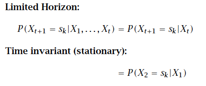
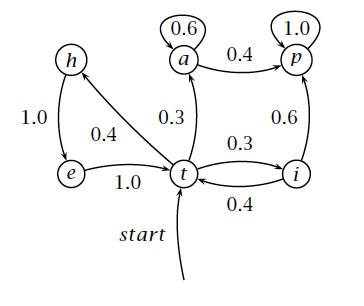
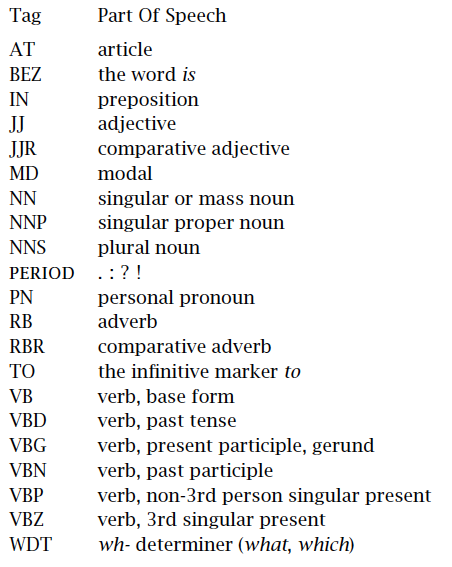

This Rmarkdown includes the notes and reading responses for my course readings in **INF2010 - Reading Course: Natural Language Processing**. 

This week's readings include:

- Silge, Julia & David Robinson, 2020, Text Mining with R, Chapters 8-9: https://www.tidytextmining.com.
- C. D. Manning and H. Schütze, Foundations of statistical natural language processing. Cambridge, Mass: MIT Press, 1999. Chapters 9-10.
- Hutchinson, Ben, Vinodkumar Prabhakaran, Emily Denton, Kellie Webster, Yu Zhong, and Stephen Denuyl, 2020, ‘Social Biases in NLP Models as Barriers for Persons with Disabilities’, arXiv, https://arxiv.org/abs/2005.00813.
- Natali Ruchansky, Sungyong Seo, and Yan Liu. 2017. CSI: A Hybrid Deep Model for Fake News Detection. In Proceedings of the 2017 ACM on Conference on Information and Knowledge Management (CIKM '17). Association for Computing Machinery, New York, NY, USA, 797–806. DOI:https://doi-org.myaccess.library.utoronto.ca/10.1145/3132847.3132877.

```{r setup, include=FALSE}
knitr::opts_chunk$set(
  echo = TRUE,
  message = FALSE,
  warning = FALSE
)
```

```{r, results='hide', message=FALSE}
# Import libraries
library(tidyverse)
library(jsonlite)
library(tidytext)
library(widyr)
library(ggplot2)
library(igraph)
library(ggraph)
library(topicmodels)
library(purrr)
library(readr)
```

## Text Mining with R

### Chapter 8 - Case study: mining NASA metadata

#### Importing NASA metadata

```{r}
# Download NASA metadata
metadata <- fromJSON("https://data.nasa.gov/data.json") 
```

```{r}
# Create some custom stop words
my_stopwords <- tibble(word = c(as.character(1:12), "v1", "v03", "l2", "l3", "l4", "v5.2.0", "v003", "v004", "v005", "v006", "v7", "v3.0", "v1.0", "nbsp", "amp", "gt", "lt", "timesnewromanpsmt", "font", "td", "li", "br", "tr", "quot", "st", "img", "src", "strong", "http", "file", "files"))
```


```{r}
# Create tibble for the titles, split tokens, remove stop words
nasa_title <- tibble(id = metadata$dataset$identifier, 
                     title = metadata$dataset$title) %>% 
  unnest_tokens(word, title) %>% 
  anti_join(stop_words, by = "word") %>% 
  anti_join(my_stopwords, by = "word")

# Create tibble for the descriptions, split tokens, remove stop words
nasa_desc <- tibble(id = metadata$dataset$identifier, 
                    desc = metadata$dataset$description) %>% 
  unnest_tokens(word, desc) %>% 
  anti_join(stop_words, by = "word") %>% 
  anti_join(my_stopwords, by = "word")

# Create tibble for keywords, split tokens, remove stop words, convert to uppercase
nasa_keyword <- tibble(id = metadata$dataset$identifier, 
                       keyword = metadata$dataset$keyword) %>%
  unnest(keyword) %>% 
  mutate(keyword = toupper(keyword))
```

#### Word co-occurences and correlations

```{r, warning=FALSE}
# Create title word pair counts
title_word_pairs <- nasa_title %>% 
  pairwise_count(word, id, sort = TRUE, upper = FALSE)

# Create description word pair counts
desc_word_pairs <- nasa_desc %>% 
  pairwise_count(word, id, sort = TRUE, upper = FALSE)

keyword_pairs <- nasa_keyword %>% 
  pairwise_count(keyword, id, sort = TRUE, upper = FALSE)
```

```{r}
# Create a network plot for title word pairs
set.seed(1234)
title_word_pairs %>%
  filter(n >= 250) %>%
  graph_from_data_frame() %>%
  ggraph(layout = "fr") +
  geom_edge_link(aes(edge_alpha = n, edge_width = n), edge_colour = "cyan4") +
  geom_node_point(size = 5) +
  geom_node_text(aes(label = name), repel = TRUE, 
                 point.padding = unit(0.2, "lines")) +
  theme_void()
```

```{r}
# Create a network plot for description word pairs
desc_word_pairs %>%
  filter(n >= 2000) %>%
  graph_from_data_frame() %>%
  ggraph(layout = "fr") +
  geom_edge_link(aes(edge_alpha = n, edge_width = n), edge_colour = "darkred") +
  geom_node_point(size = 5) +
  geom_node_text(aes(label = name), repel = TRUE,
                 point.padding = unit(0.2, "lines")) +
  theme_void()
```

```{r}
# Create a network plot for keyword pairs
keyword_pairs %>%
  filter(n >= 700) %>%
  graph_from_data_frame() %>%
  ggraph(layout = "fr") +
  geom_edge_link(aes(edge_alpha = n, edge_width = n), edge_colour = "royalblue") +
  geom_node_point(size = 5) +
  geom_node_text(aes(label = name), repel = TRUE,
                 point.padding = unit(0.2, "lines")) +
  theme_void()
```

#### Calculating tf-idf for the description fields

```{r}
# Calculate TF-IDF for description tokens
desc_tf_idf <- nasa_desc %>% 
  count(id, word, sort = TRUE) %>%
  ungroup() %>%
  bind_tf_idf(word, id, n)

desc_tf_idf %>% 
  arrange(-tf_idf)
```

```{r}
# Join description tf-idf with our keywords
desc_tf_idf <- full_join(desc_tf_idf, nasa_keyword, by = "id")

# Plot top 15 tf-idf for several keywords
desc_tf_idf %>% 
  filter(!near(tf, 1)) %>%
  filter(keyword %in% c("SOLAR ACTIVITY", "CLOUDS", 
                        "SEISMOLOGY", "ASTROPHYSICS",
                        "HUMAN HEALTH", "BUDGET")) %>%
  arrange(desc(tf_idf)) %>%
  group_by(keyword) %>%
  distinct(word, keyword, .keep_all = TRUE) %>%
  slice_max(tf_idf, n = 15, with_ties = FALSE) %>% 
  ungroup() %>%
  mutate(word = factor(word, levels = rev(unique(word)))) %>%
  ggplot(aes(tf_idf, word, fill = keyword)) +
  geom_col(show.legend = FALSE) +
  facet_wrap(~keyword, ncol = 3, scales = "free") +
  labs(title = "Highest tf-idf words in NASA metadata description fields",
       caption = "NASA metadata from https://data.nasa.gov/data.json",
       x = "tf-idf", y = NULL)
```

#### Topic modeling

```{r eval=FALSE}
# Create description document-term-matrix
desc_dtm <- nasa_desc %>% 
  count(id, word, sort = TRUE) %>% 
  cast_dtm(id, word, n)

# Run the latent Dirichlet allocation (LDA)
desc_lda <- LDA(desc_dtm, k = 24, control = list(seed = 1234)) %>% 
  tidy()

# Get the top 10 terms per topic
top_terms <- desc_lda %>% 
  group_by(topic) %>% 
  slice_max(beta, n = 10, with_ties = FALSE) %>% 
  ungroup() %>% 
  arrange(topic, -beta)

# Plot our top 10 terms per topic
top_terms %>%
  mutate(term = reorder_within(term, beta, topic)) %>%
  group_by(topic, term) %>%    
  arrange(desc(beta)) %>%  
  ungroup() %>%
  ggplot(aes(beta, term, fill = as.factor(topic))) +
  geom_col(show.legend = FALSE) +
  scale_y_reordered() +
  labs(title = "Top 10 terms in each LDA topic",
       x = expression(beta), y = NULL) +
  facet_wrap(~ topic, ncol = 4, scales = "free")
```

The `LDA()` took > 10 mins to run, I am going to leave the output out but leave the code above for reference.

### Chapter 9 - Case study: analyzing usenet text

#### Pre-processing

```{r}
# Directory for our data
training_folder <- "./20_newsgroups/"

# Function to read a folder into a tibble
read_folder <- function(infolder) {
  tibble(file = dir(infolder, full.names = TRUE)) %>%
    mutate(text = map(file, read_lines)) %>%
    transmute(id = basename(file), text) %>%
    unnest(text)
}

# Read every sub-folder within our data folder into a tibble 
raw_text <- tibble(folder = dir(training_folder, full.names = TRUE)) %>%
  mutate(folder_out = map(folder, read_folder)) %>%
  unnest(cols = c(folder_out)) %>%
  transmute(newsgroup = basename(folder), id, text)
```

```{r}
# Data cleaning 
cleaned_text <- raw_text %>%
  group_by(newsgroup, id) %>%
  filter(cumsum(text == "") > 0,
         cumsum(str_detect(text, "^--")) == 0) %>%
  ungroup() %>% 
  filter(str_detect(text, "^[^>]+[A-Za-z\\d]") | text == "",
         !str_detect(text, "writes(:|\\.\\.\\.)$"),
         !str_detect(text, "^In article <"),
         !id %in% c(9704, 9985))
```

```{r}
# Split tokens and remove stop words
usenet_words <- cleaned_text %>%
  unnest_tokens(word, text) %>%
  filter(str_detect(word, "[a-z']$"),
         !word %in% stop_words$word)

usenet_words
```

#### TD-IDF in newsgroups

```{r}
# Count the number of words per newsgroup
words_by_newsgroup <- usenet_words %>%
  count(newsgroup, word, sort = TRUE) %>%
  ungroup()

# Calculate tf-idf for each newsgroup
tf_idf <- words_by_newsgroup %>% 
  bind_tf_idf(word, newsgroup, n) %>% 
  arrange(desc(tf_idf))

# Plot top 12 tf-idf for each science related newsgroup
tf_idf %>%
  filter(str_detect(newsgroup, "^sci\\.")) %>%
  group_by(newsgroup) %>%
  slice_max(tf_idf, n = 12) %>%
  ungroup() %>%
  mutate(word = reorder(word, tf_idf)) %>%
  ggplot(aes(tf_idf, word, fill = newsgroup)) +
  geom_col(show.legend = FALSE) +
  facet_wrap(~ newsgroup, scales = "free") +
  labs(x = "tf-idf", y = NULL)
```

#### Topic modeling

```{r}
# For science newsgroups, filter words occurring > 50 and create a dtm
sci_dtm <- usenet_words %>%
  filter(str_detect(newsgroup, "^sci")) %>%
  group_by(word) %>%
  mutate(word_total = n()) %>%
  ungroup() %>%
  filter(word_total > 50) %>% 
  unite(document, newsgroup, id) %>%
  count(document, word) %>%
  cast_dtm(document, word, n)

# Run LDA topic modeling
sci_lda <- LDA(sci_dtm, k = 4, control = list(seed = 2016))

# Plot top 8 terms per topic
sci_lda %>%
  tidy() %>%
  group_by(topic) %>%
  slice_max(beta, n = 8) %>%
  ungroup() %>%
  mutate(term = reorder_within(term, beta, topic)) %>%
  ggplot(aes(beta, term, fill = factor(topic))) +
  geom_col(show.legend = FALSE) +
  facet_wrap(~ topic, scales = "free") +
  scale_y_reordered()
```

From our topic modeling it looks like Topic 1 is sci.med because of "medical" and "disease". Topic 2 is sci.space because of "space" and "nasa". Topic 3 is sci.electronics because of "db" and "data". Topic 4 is sci.crypt because of "key" and "encryption". 

```{r}
# Plot gamma against document per newsgroup
sci_lda %>%
  tidy(matrix = "gamma") %>%
  separate(document, c("newsgroup", "id"), sep = "_") %>%
  mutate(newsgroup = reorder(newsgroup, gamma * topic)) %>%
  ggplot(aes(factor(topic), gamma)) +
  geom_boxplot() +
  facet_wrap(~ newsgroup) +
  labs(x = "Topic",
       y = "# of messages where this was the highest % topic")
```

#### Sentiment Analysis

```{r, eval=FALSE}
# Find sentiment per newsgroup
newsgroup_sentiments <- words_by_newsgroup %>%
  inner_join(get_sentiments("afinn"), by = "word") %>%
  group_by(newsgroup) %>%
  summarize(value = sum(value * n) / sum(n))

# Plot sentiment per newsgroup1
newsgroup_sentiments %>%
  mutate(newsgroup = reorder(newsgroup, value)) %>%
  ggplot(aes(value, newsgroup, fill = value > 0)) +
  geom_col(show.legend = FALSE) +
  labs(x = "Average sentiment value", y = NULL)
```

```{r, eval=FALSE}
# Find sentiment per word
contributions <- usenet_words %>%
  inner_join(get_sentiments("afinn"), by = "word") %>%
  group_by(word) %>%
  summarize(occurences = n(),
            contribution = sum(value))

# Plot the top sentiments per word
contributions %>%
  slice_max(abs(contribution), n = 25) %>%
  mutate(word = reorder(word, contribution)) %>%
  ggplot(aes(contribution, word, fill = contribution > 0)) +
  geom_col(show.legend = FALSE) +
  labs(y = NULL)
```

RMarkdown has a problem importing AFINN sentiments. Code output is not shown for that reason. 

## Foundation's of Statistical Natural Language Processing

### Chapter 10 - Markov Models

An **Hidden Markov Model (HMM)** is nothing more than a probabilistic function of a Markov process.

Can be used when a sequence of random variables are NOT independent but rather each variable depends on previous elements in the sequence.

Markov Properties:

- **Limited Horizon**
- **Time invariant** (stationary)



A Markov model can be thought of as a (nondetermenistic) finite state automation.



In general, any fixed finite amount of history can always be encoded in this way by simply elaborating the state space as a crossproduct of multiple previous states

In an HMM, you don’t know the state sequence that the model passes through, but only some probabilistic function of it. This is known through a **emission probability**.

HMMs are useful when one can think of **underlying events** probabilistically generating **surface events**.

An HMM consists of the following elements:

- a set of states 
- an output alphabet
- initial state probabilities 
- state transiotion prababilities
- symbol emission probabilities

### Chapter 10 - Part-of-Speech Tagging

**Tagging** is the task of labeling (or tagging) each word in a sentence with its appropriate part of speech.



A ‘dumb’ tagger that simply assigns the most common tag to each word performs at the surprisingly high level of 90% correct.

In **Markov Model tagging**, we look at the sequence of tags in a text as a Markov chain.

Markov model tagging can be extended to **bigram tagging**, **trigram tagging** and **Variable Memory Markov Models (VMMM)**.

Markov Models work well when we have a large tagged training set. If we have no training data we can use **Hidden Markov Model Tagging**.

**Transformation-based tagging** can explore a wider range of lexical and syntactic regularities. As input data, we need a tagged corpus and a dictionary. We first tag each word in the training corpus with its most frequent tag – that is what we need the dictionary for. The learning algorithm then constructs a ranked list of transformations that transforms the initial tagging into a tagging that is close to correct. This ranked list can be used to tag new text, by again initially choosing each word’s most frequent tag, and then applying the transformations.

The great advantage of transformation-based tagging is that it can condition tagging decisions on a richer set of events than the probabilistic models we looked at earlier.

Other tagging models include:

- decision trees
- probabilistic models
- automata

## Social Biases in NLP Models as Barriers for Persons with Disabilities

In Hutchinson et al.’s Social Biases in NLP Models as Barriers for Persons with Disabilities, they explore the prevalence of harmful social biases about persons with disabilities in modern NLP techniques. They look at the biases in text classification models, in language representations and in the data that is used to train these models. They argue that left unchecked, NLP models can propagate harmful stereotypes about persons with disabilities and that more action should be made to prevent this from happening. 

Hutchinson et al. collected 56 expressions referring to people with disabilities and categorize them into recommended or non-recommended by consulting three US-based organizations. For example, a recommended expression referring to someone with mental illness would be a person with a mental health disability, while a non-recommended expression would be an insane person. 

Using this dataset of expressions, they evaluated a Reddit sub-corpus using sentiment analysis and a toxicity model. They found that phrases referring to those with a disability were more likely to be associated with toxicity. Similarly, for sentiments they found an association between disability and negative sentiments. 

Hutchinson et al. furthermore explored biases in language representations. Specifically, they looked at the widely used bidirectional Transformer (BERT) and how it represents persons with disabilities. They found BERT “associates words with more negative sentiment with phrases referencing persons with disabilities.”

In this work, Hutchinson et al., have shown evidence of harmful language representations of persons with disabilities. It is shown that if the language and corpora contain harmful biases and stereotypes NLP models will “learn” this language and further propagate it. Thus, it is important to be conscious of the text we train our models on, and the associations that are models learn. 

*Hutchinson, Ben, Vinodkumar Prabhakaran, Emily Denton, Kellie Webster, Yu Zhong, and Stephen Denuyl, 2020, ‘Social Biases in NLP Models as Barriers for Persons with Disabilities’, arXiv, https://arxiv.org/abs/2005.00813.*


## CSI: A Hybrid Deep Model for Fake News Detection

In Ruchansky et al.’s CSI: A Hybrid Deep Model for Fake News Detection, they develop a machine learning model named CSI, with the objective of classifying fake news and identifying suspicious users that propagate fake news. CSI, which stands for Capture, Score and Integrate combines various techniques used in previous fake news detection work into a hybrid model. Previous work looked at one of the three aspects of online news. The first being the text, which includes the headline, and content of the article. Second, the response of the article, which include comments, likes, shares, and reactions. Keep in mind that the response varies depending on the platform (Facebook has reactions, blogs may only have comments). Third, is the source of the article, who it was written by. Ruchansky et al. develop a Recurrent Neural Network that is trained from all three aspects of online news. Ruchansky et al. trained this model using data from Twitter and Weibo. They found that their CSI model, accounting for all three aspects of fake news can accurately predict fake news content. 

Ruchansky et al.’s work builds off previous work by creating a hybrid model that accounts for text, response and the source. One limitation of this work, that the authors have identified, is that fake news detection is a technically challenging problem because it is difficult to determine what makes an article fake or not. Determining whether an article is fake is a problem for human subjects as well. Majority of human subjects are not able to tell when an article is fake, so crowdsourcing cannot be used to construct reliable datasets. To determine this, rigorous fact checking, and specialists are needed to determine if information presented in an article is credible. Complexity arises when truths are mixed in facts that are partially true. Overall, this presents a difficulty in evaluating fake news detection models and creating data sets to train these models. 

*Natali Ruchansky, Sungyong Seo, and Yan Liu. 2017. CSI: A Hybrid Deep Model for Fake News Detection. In Proceedings of the 2017 ACM on Conference on Information and Knowledge Management (CIKM '17). Association for Computing Machinery, New York, NY, USA, 797–806. DOI:https://doi-org.myaccess.library.utoronto.ca/10.1145/3132847.3132877.*

